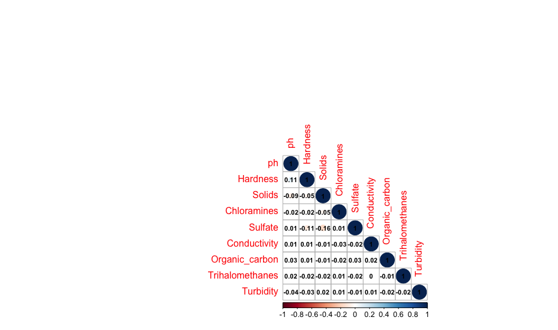

# Exploring Water drinkability: Project Overview 
* Extract, transform, load dataset
* Dealing missing data entries
* Encode catagorical columns 
* Check for bias
* Pivot tables 
* Show relatonship between variables 
* Built visualizations 

## Code and Resources Used
__RStudio__: Version 1.4.1717\
__Packages__: tidyverse, gridExtra, corrplot\
__Data source__: [kaggle](https://www.kaggle.com/adityakadiwal/water-potability)

## Data
Water quality metrics
1. pH value
2. Hardness
3. Soilds (Total dissolved solids - TDS)
4. Chloramines
5. Sulfate
6. Conductivity
7. Organic carbon
8. Trihalomethanes
9. Turbidity

## EDA (Exploratory data analysis) 
I looked at the distributions and spread of the continuous variables (independent) in relation to the drinkability of water (dependent). Below are a few highlights.\

## Conclusion 
1. Unequal water samples. We have a higher amount of undrinkable water than drinking water.
2. Some of the drinkable water have water metrics that aren't sustainable for drinking. 
3. The dataset seems to be created manually. 
4. No correlation between variables. I found this weird because I have keep fish and ph has some relations with Hardness. 
