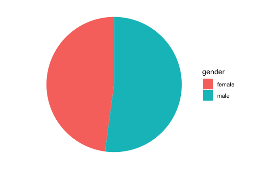
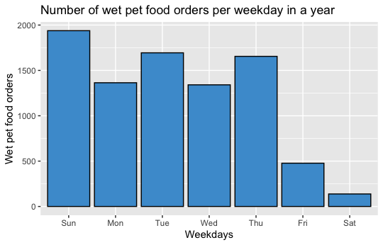
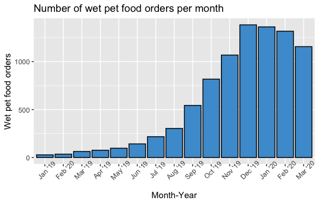
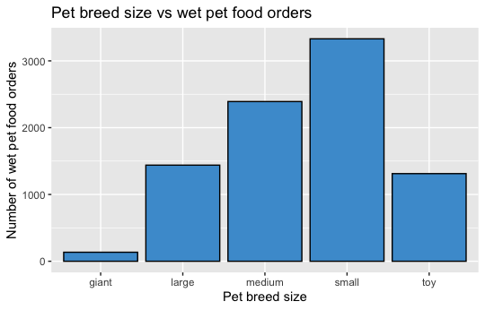
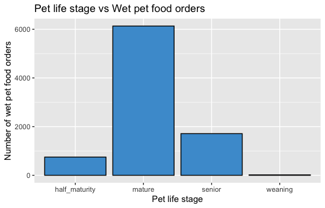

## Objective 

Main task is to generate actionable insights from this pet food customer orders data set.
As a focus area, I to address the following questions:

* Which customers order and reorder the wet food, and when are they likely to try it?
* Are there certain characteristics of the pets, customers or their orders that impact how likely they are to purchase the wet food, and keep ordering it?
* Based on this data, what do you suggest we focus on to get more customers taking and continuing to enjoy our wet food?

## Data Source 
This data set is a selection of customers and their orders. This task was provided by Jahangir Raina on [Kaggle](https://www.kaggle.com/jahangirraina/pet-food-customer-orders-online/tasks?taskId=2615).

The data is in wide format. There's no information on where the data came from or how it was collected.The data set has several missing entries. 

## Libraries
* tidyverse
* lubridate

## Conclusion
* There no huge difference in genders
* Must pet food is bought during the holiday seasons 
* Sunday, Tuesday and Thursdays are popular days that wet pet food is purchase 
* wet pet food are common with small pet owners 
* mature pets
* super premium is the must popular pet food tier
* favorite flavors include Chicken and Beef Chicken Lamb
* digestion and skin & coat are common issue among pets 
* Null & Default (walk-ins) and Search Generic are the

## Insights 

*Gender of pets.

## Suggestions

* Stocking products that is good for digestion, skin and coat.
* Making it clear on the website the different variety of wet food  products 
* Stock more Chicken and Beef Chicken Lamb flavor foods.

