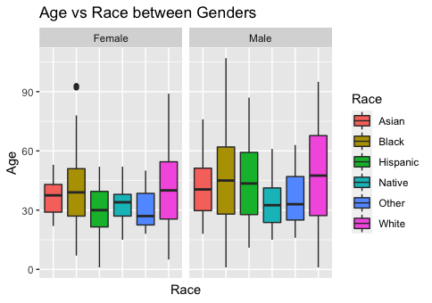

## Data Summary 
This dataset aims to provide insight into individuals who were killed during alteractions with police. It includes information on their age, race, mental health status, weapons they were armed with, and if they were fleeing.

## Libraries 
*tidyverse
*lubridate
*ggthemes

## Data source 
This dataset comes from https://data.world/awram/us-police-involved-fatalities.

## insights 
### We have more men than female deaths: 
* **it can be that more men get killed than women.** 
* **its possible that women weren't fully represented in the dataset.**
* **I also omitted several missing values.**

### Race 
**Whites have the highest death. 
**Remember I did omit over a thousand missing race values.**

### States

**California has the highest death count.**

### Weekdays 
**Weekdays show no relationship to death count.**

### Year

* **2015 has the highest death count**
* **2013 and 2014 have the same death count**
* **a plunge in death from 2015 to 2016**

### Manner of Death

### Age Distribution 

**There are 2 local modes**

*Native and Other have the youngest death age.
*Women have a lower age average between races.

## Suggestions 
* **There are several missing values for a couple columns, I can't say for sure my conclusion are valid especially during this period of BLM movement. But I do believe my analysis with the present data holds water.**
* **The state population would be a nice addition to the dataset a so calculating the death rate would be a better metric to measure than death count.**